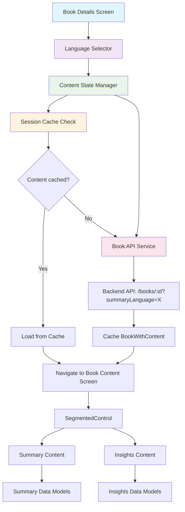
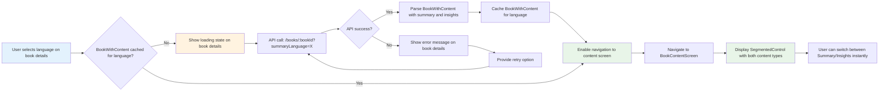
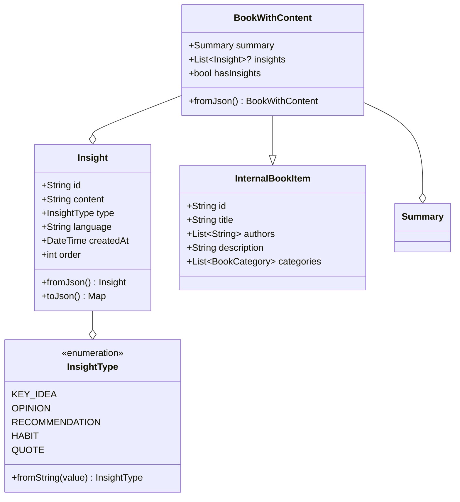

# Design Document: Book Insights Feature

## Overview

The Book Insights feature enhances the InsiBook Mobile application by providing users with bite-sized, categorized knowledge extracted from books as an alternative to comprehensive summaries. This feature uses a SegmentedControl-based tab interface within a single screen, eliminating complex navigation while utilizing the unified books API that returns both summary and insights together, enabling simple session caching and a sophisticated table-based UI for displaying different types of insights (key ideas, opinions, recommendations, habits, quotes).

### Design Goals

- Provide alternative content consumption mode for time-constrained users
- Maintain backward compatibility with existing summary functionality  
- Implement efficient data loading and caching strategies
- Create intuitive tab-based switching between summary and insights content
- Follow Material 3 design principles for SegmentedControl and visual hierarchy
- Support multi-language insights with proper language awareness and localization

### Scope

- Replace existing SummaryReaderScreen with unified BookContentScreen
- Implement SegmentedControl for Summary/Insights content switching
- Create insights display component with categorized table presentation
- Implement session-based caching for complete book content (summary + insights)
- Utilize existing books API that returns both summary and insights with language awareness
- Support multi-language insights content and proper localization handling
- Maintain existing summary functionality without disruption

## Architecture Design

### System Architecture Diagram



### Data Flow Diagram



## Component Design

### BookContentScreen Component

**Responsibilities:**
- Display unified interface with SegmentedControl for Summary/Insights switching
- Handle content type state management (ContentType enum)
- Coordinate between summary and insights content display
- Maintain consistent theming and layout across content types

**Interfaces:**
```dart
class BookContentScreen extends StatefulWidget {
  final InternalBookItem book;
  final String selectedLanguage;
  final ContentType initialContentType;
}

class _BookContentScreenState extends State<BookContentScreen> {
  ContentType _selectedContentType;
  
  void _onSegmentChanged(ContentType contentType);
  Widget _buildSegmentedControl();
  Widget _buildContent();
}

enum ContentType { summary, insights }
```

**Dependencies:**
- Material 3 SegmentedButton widget
- SummaryContent component
- InsightsContent component

### InsightsContent Component

**Responsibilities:**
- Display insights in categorized table format
- Handle lazy loading and error states for insights specifically
- Implement smooth scrolling performance
- Provide visual feedback during loading

**Interfaces:**
```dart
class InsightsContent extends StatefulWidget {
  final InternalBookItem book;
  final String selectedLanguage;
}

class _InsightsContentState extends State<InsightsContent> {
  bool _isLoading;
  List<Insight>? _insights;
  String? _errorMessage;
  
  Future<void> _loadInsights();
  Widget _buildInsightsTable();
  Widget _buildInsightRow(Insight insight);
  Color _getInsightTypeColor(InsightType type);
  IconData _getInsightTypeIcon(InsightType type);
}
```

**Dependencies:**
- BookApiService.getBook() method for unified data fetching
- BookContentCache for caching complete book data
- Material 3 theming system
- LanguageProvider for localization

### BookContentCache Component

**Responsibilities:**
- Cache complete book content (summary + insights) per book ID and language
- Provide cache hit/miss detection for unified content
- Clear cache on app lifecycle events
- Optimize memory usage with LRU eviction

**Interfaces:**
```dart
class BookContentCache {
  static final Map<String, BookWithContent> _cache = {};
  static const int _maxCacheSize = 50;
  
  static String _getCacheKey(String bookId, String language) => '${bookId}_$language';
  
  static BookWithContent? get(String bookId, String language);
  static void set(String bookId, String language, BookWithContent bookContent);
  static bool has(String bookId, String language);
  static bool hasInsights(String bookId, String language);
  static void clear();
  static void evictLRU();
}
```

**Dependencies:**
- None (standalone utility class)

### SummaryContent Component

**Responsibilities:**
- Display existing summary functionality within the unified screen
- Maintain all existing summary features and behavior
- Integrate seamlessly with SegmentedControl switching
- Preserve scroll positions when switching between content types

**Interfaces:**
```dart
class SummaryContent extends StatefulWidget {
  final InternalBookItem book;
  final String selectedLanguage;
}

class _SummaryContentState extends State<SummaryContent> {
  // Existing summary functionality preserved
  Widget _buildSummaryContent();
}
```

**Dependencies:**
- BookApiService.getBook() method for fetching unified book content
- BookContentCache for caching
- Material 3 theming system
- LanguageProvider for localization

### BookApiService Updates

**Responsibilities:**
- Utilize existing getBook() method that now returns both summary and insights
- Handle language-specific content requests via summaryLanguage parameter
- Maintain full backward compatibility with existing summary functionality
- Process unified API response containing both content types

**Interfaces:**
```dart
class BookApiService {
  // Existing method now returns both summary AND insights
  Future<ApiResult<BookWithContent>> getBook(String bookId, {String? summaryLanguage});
  
  // All other existing methods remain unchanged for backward compatibility
  Future<ApiResult<BookWithContent>> getBookWithSummary(String bookId, {String? summaryLanguage});
  // ... other existing methods
}
```

**Dependencies:**
- HTTP client for API communication
- JSON serialization utilities
- BookWithContent and related data models (now includes insights)

**Implementation Details:**
```dart
class BookApiService {
  // Existing getBook method now returns both summary AND insights
  Future<ApiResult<BookWithContent>> getBook(String bookId, {String? summaryLanguage}) async {
    try {
      final queryParams = <String, String>{};
      if (summaryLanguage != null) {
        queryParams['summaryLanguage'] = summaryLanguage;
      }
      
      final uri = Uri.parse('$baseUrl/books/$bookId')
          .replace(queryParameters: queryParams);
      
      final response = await http.get(uri, headers: {'Content-Type': 'application/json'})
          .timeout(const Duration(seconds: 15));
      
      if (response.statusCode == 200) {
        final data = json.decode(response.body);
        return ApiResult.success(BookWithContent.fromJson(data));
      } else {
        return ApiResult.failure('Failed to fetch book: ${response.statusCode}');
      }
    } catch (e) {
      return ApiResult.failure('Network error: ${e.toString()}');
    }
  }
  
  // Backward compatibility - getBook already includes insights now
  Future<ApiResult<BookWithContent>> getBookWithSummary(String bookId, {String? summaryLanguage}) {
    return getBook(bookId, summaryLanguage: summaryLanguage);
  }
}
```

## Data Model

### Unified API Response Architecture

This design leverages the existing **BookWithContent** data model, which has been enhanced to include insights data from the unified books API. This approach:

1. **BookWithContent**: Enhanced to include insights field alongside existing summary data
2. **Single API Call**: `/books/:id?summaryLanguage=X` returns both summary and insights
3. **Backward Compatibility**: Existing code continues to work unchanged

**Benefits of Unified API Approach:**
- Eliminates separate API calls and complex data coordination
- Simplifies caching strategy with single source of truth
- Maintains full backward compatibility with existing BookWithContent usage
- Reduces loading complexity and improves performance
- No need for composition patterns or multiple data models

### Core Data Structure Definitions

```dart
enum InsightType {
  keyIdea('key_idea'),
  opinion('opinion'), 
  recommendation('recommendation'),
  habit('habit'),
  quote('quote');
  
  const InsightType(this.value);
  final String value;
  
  static InsightType fromString(String value) {
    return values.firstWhere(
      (type) => type.value == value,
      orElse: () => InsightType.keyIdea,
    );
  }
}

class Insight {
  final String id;
  final String content;
  final InsightType type;
  final String language;
  final DateTime createdAt;
  final int order;

  const Insight({
    required this.id,
    required this.content,
    required this.type,
    required this.language,
    required this.createdAt,
    required this.order,
  });

  factory Insight.fromJson(Map<String, dynamic> json) {
    return Insight(
      id: json['id']?.toString() ?? '',
      content: json['content']?.toString() ?? '',
      type: InsightType.fromString(json['type']?.toString() ?? 'key_idea'),
      language: json['language']?.toString() ?? 'en',
      createdAt: DateTime.tryParse(json['createdAt']?.toString() ?? '') ?? DateTime.now(),
      order: json['order'] is int ? json['order'] : 0,
    );
  }

  Map<String, dynamic> toJson() {
    return {
      'id': id,
      'content': content,
      'type': type.value,
      'language': language,
      'createdAt': createdAt.toIso8601String(),
      'order': order,
    };
  }
}

// BookWithContent is enhanced to include insights from unified API response
class BookWithContent extends InternalBookItem {
  final Summary summary;
  final List<Insight>? insights; // New field for insights data

  BookWithContent({
    required super.id,
    required super.googleBookId,
    required super.title,
    super.subtitle,
    required super.authors,
    super.publisher,
    super.publishedDate,
    super.description,
    required super.categories,
    required super.language,
    super.pageCount,
    super.imageUrl,
    super.googleBookCoverImageUrl,
    super.previewLink,
    super.infoLink,
    super.canonicalLink,
    super.industryIdentifiers,
    required super.summaryCount,
    required super.createdAt,
    required super.updatedAt,
    required this.summary,
    this.insights, // Optional insights from unified API
  });

  factory BookWithContent.fromJson(Map<String, dynamic> json) {
    return BookWithContent(
      // ... existing fields unchanged ...
      summary: Summary.fromJson(json['summary']),
      insights: json['insights'] != null
          ? (json['insights'] as List<dynamic>)
              .map((insight) => Insight.fromJson(insight))
              .toList()
          : null,
    );
  }

  // Helper method for insights availability
  bool get hasInsights => insights != null && insights!.isNotEmpty;
}
```

### Data Model Diagrams




## Error Handling Strategy

### API Error Handling (Book Details Screen)

**Network Connectivity Issues:**
```dart
// This happens on book details screen before navigation
try {
  final result = await bookApiService.getBook(
    bookId,
    summaryLanguage: selectedLanguage
  );
  // Enable navigation to BookContentScreen on success
  _enableContentNavigation(result.data);
} on TimeoutException {
  _showRetryableError('Connection timed out. Please check your network.');
} on SocketException {
  _showRetryableError('No internet connection. Please try again.');
} catch (e) {
  _showGenericError('Failed to load content. Please try again later.');
}
```

**API Response Handling on Book Details Screen:**
- **404 Not Found:** Display "Content not yet available for this book in selected language"
- **403 Forbidden:** Check authentication and refresh tokens
- **500 Server Error:** Show generic error with retry option
- **Malformed Data:** Gracefully handle with partial content loading and error logging
- **Success:** Enable navigation buttons and cache content for selected language

### BookContentScreen Error Handling

**Content Display Issues:**
- Handle missing insights gracefully by disabling Insights segment in SegmentedControl
- Show partial content if only summary or insights data is available
- Display friendly message when selected content type has no data
- Maintain SegmentedControl functionality with available content only

**Data Validation:**
- Validate preloaded BookWithContent structure before display
- Handle null/empty insights or summary gracefully
- Show appropriate empty states for missing content types

**Session Cache Issues:**
- Implement LRU eviction when cache reaches size limit
- Clear cache gracefully during low memory warnings
- Handle cache corruption by disabling affected content segments

### Backward Compatibility Safeguards

**Summary Functionality Protection:**
- Insights errors never affect summary content functionality  
- Separate error states prevent cascade failures between content types
- Independent content rendering ensures summary remains accessible
- API failures disable insights segment but preserve summary functionality without user disruption

**Unified API Compatibility:**

- Existing `BookWithContent` classes are enhanced to include insights field
- `InternalBookItem` remains unchanged as base class
- Single API call returns complete book data with both summary and insights
- Components receive enhanced `BookWithContent` with insights included
- Caching system works with unified `BookWithContent` objects
- API service maintains full backward compatibility - existing calls continue to work

**Migration Path:**

```dart
// Existing code continues to work exactly as before:
BookWithContent existingBook = await apiService.getBookWithContent(bookId);
// Now also includes insights if available!

// New unified API usage (same method, now returns insights too):
BookWithContent book = await apiService.getBook(bookId, summaryLanguage: 'en');
// Contains both summary AND insights

// Components work with single enhanced model:
SummaryContent(book: book); // Uses book.summary
InsightsContent(book: book); // Uses book.insights
```

**Naming Migration Note:**

The data model uses `BookWithContent` to better reflect that it contains both summary and insights content. This naming convention ensures clarity about the unified content approach:

- Class name: `BookWithContent` (contains both summary and insights)
- Variable names: `bookWithContent` for clarity
- Method return types: `Future<ApiResult<BookWithContent>>` for unified content
- Cache operations: All cache methods now work with `BookWithContent` objects
- Component interfaces: All components now receive `BookWithContent` instances

The enhanced model maintains the same structure and functionality while providing a more accurate name that reflects its unified content approach.

## Testing Strategy

### Unit Tests

**Data Model Testing:**

```dart
// Test BookWithContent includes insights from unified API
test('BookWithContent.fromJson includes insights when present', () {
  final json = {
    'id': 'test-book-id',
    'title': 'Test Book',
    'authors': ['Test Author'],
    'summary': {'chapters': []},
    'insights': [
      {
        'id': 'test-id',
        'content': 'Test insight content',
        'type': 'key_idea',
        'language': 'en',
        'createdAt': '2025-01-01T00:00:00Z',
        'order': 1,
      }
    ],
    // ... other required fields
  };
  
  final book = BookWithContent.fromJson(json);
  expect(book.hasInsights, isTrue);
  expect(book.insights?.length, equals(1));
  expect(book.insights?.first.type, equals(InsightType.keyIdea));
});

// Test InsightType enum conversion  
test('InsightType.fromString handles all valid types', () {
  expect(InsightType.fromString('key_idea'), equals(InsightType.keyIdea));
  expect(InsightType.fromString('invalid'), equals(InsightType.keyIdea));
});
```

**Cache Testing:**

```dart
test('BookContentCache stores and retrieves unified book data', () {
  final book = BookWithContent(/* with insights */);
  BookContentCache.set('book-123', 'en', book);
  
  expect(BookContentCache.hasInsights('book-123', 'en'), isTrue);
  expect(BookContentCache.get('book-123', 'en')?.hasInsights, isTrue);
});
```

### Integration Tests

**SegmentedControl Flow Testing:**

```dart
testWidgets('Switch from summary to insights using SegmentedControl', (tester) async {
  await tester.pumpWidget(MyApp());
  await tester.tap(find.text('View Book')); // Navigate to BookContentScreen
  await tester.pumpAndSettle();
  
  // Verify initial summary content
  expect(find.byType(SummaryContent), findsOneWidget);
  
  // Tap insights segment
  await tester.tap(find.text('Insights'));
  await tester.pumpAndSettle();
  
  expect(find.byType(InsightsContent), findsOneWidget);
});
```

**API Integration Testing:**

```dart
testWidgets('Loads insights from unified API when switching to insights segment', (tester) async {
  // Mock unified API response with BookWithContent including insights
  final mockBook = BookWithContent(
    id: 'test-id',
    title: 'Test Book',
    authors: ['Test Author'],
    summary: mockSummary,
    insights: mockInsights,
    // ... other required fields
  );
  when(mockApiService.getBook(
    any,
    summaryLanguage: any,
  )).thenAnswer((_) async => ApiResult.success(mockBook));
  
  await tester.pumpWidget(
    MaterialApp(
      home: BookContentScreen(
        book: testBook,
        selectedLanguage: 'en',
      ),
    ),
  );
  
  // Switch to insights segment
  await tester.tap(find.text('Insights'));
  await tester.pump(); // Trigger loading
  await tester.pump(); // Complete async operation
  
  verify(mockApiService.getBook(
    testBook.id,
    summaryLanguage: 'en',
  )).called(1);
  expect(find.byType(DataTable), findsOneWidget);
});

testWidgets('BookContentScreen works with unified API response', (tester) async {
  final mockBook = BookWithContent(
    id: 'test-id',
    title: 'Test Book',
    authors: ['Test Author'],
    summary: mockSummary,
    insights: mockInsights,
    // ... other required fields
  );
  
  // Test unified API: single BookWithContent contains both summary and insights
  await tester.pumpWidget(
    MaterialApp(
      home: BookContentScreen(
        book: testBook,
        selectedLanguage: 'en',
      ),
    ),
  );
  
  // Verify book title is displayed
  expect(find.text(testBook.title), findsOneWidget);
  
  // Verify SegmentedControl for content switching
  expect(find.byType(SegmentedButton), findsOneWidget);
});
```

### Widget Tests

**UI Component Testing:**

```dart
testWidgets('Displays SegmentedControl and switches content properly', (tester) async {
  await tester.pumpWidget(
    MaterialApp(
      home: BookContentScreen(book: testBook, selectedLanguage: 'en'),
    ),
  );
  
  // Verify SegmentedControl exists
  expect(find.byType(SegmentedButton), findsOneWidget);
  expect(find.text('Summary'), findsOneWidget);
  expect(find.text('Insights'), findsOneWidget);
  
  // Verify initial summary content
  expect(find.byType(SummaryContent), findsOneWidget);
  expect(find.byType(InsightsContent), findsNothing);
  
  // Switch to insights
  await tester.tap(find.text('Insights'));
  await tester.pumpAndSettle();
  
  // Verify content switched
  expect(find.byType(SummaryContent), findsNothing);
  expect(find.byType(InsightsContent), findsOneWidget);
});
```

### Performance Tests

**Scrolling Performance:**

- Test smooth scrolling with 100+ insights
- Memory usage monitoring during large data sets  
- Frame rate measurement during rapid scrolling

**Cache Performance:**

- Measure cache hit/miss ratios
- Test memory usage with multiple cached books
- Validate LRU eviction performance

**Loading Performance:**

- Measure time to first insight display
- Test loading state responsiveness
- Validate progressive loading for large datasets

This comprehensive testing strategy ensures the insights feature maintains high quality, performance, and reliability while preserving backward compatibility with existing functionality.
