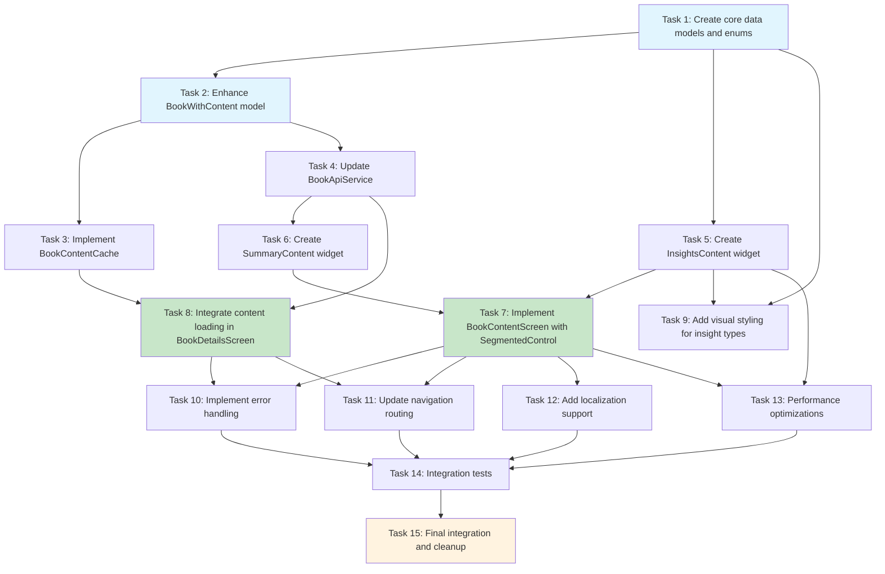

# Implementation Plan: Book Insights Feature

This document provides a step-by-step implementation plan for the Book Insights feature in InsiBook Mobile. The plan converts the approved design into actionable coding tasks that build incrementally on each other, following test-driven development practices where appropriate.

## Implementation Tasks

- [ ] 1. Create core data models and enums for insights system
  - Create Insight model with content, type, language, createdAt, and order fields
  - Define InsightType enum with values: keyIdea, opinion, recommendation, habit, quote
  - Add fromJson/toJson factory methods with null safety and error handling
  - Implement InsightType.fromString() method with fallback to keyIdea for invalid values
  - Write comprehensive unit tests for Insight model JSON serialization/deserialization
  - Test edge cases: malformed JSON, missing fields, invalid insight types
  - _Requirements: 8.1, 8.4, 8.5_

- [ ] 2. Enhance BookWithContent model to include insights from unified API
  - Create new BookWithContent class to replace BookWithSummary
  - Add optional List of Insight insights field to support unified API response structure
  - Implement hasInsights getter method to check insights availability
  - Update fromJson factory constructor to parse insights array from unified API response
  - Ensure BookWithContent provides same interface as BookWithSummary for compatibility
  - Write unit tests for BookWithContent model with and without insights data
  - Test unified API response parsing with both summary and insights included
  - _Requirements: 8.2, 8.3, 8.6, 7.3_

- [ ] 3. Implement BookContentCache for session-based content caching
  - Create BookContentCache utility class for caching complete book content per language
  - Implement language-aware cache key generation using pattern "bookId_language"
  - Add methods: get(), set(), has(), hasInsights(), clear(), and evictLRU()
  - Implement LRU eviction strategy with maximum cache size of 50 items
  - Add cache hit/miss detection for unified content retrieval
  - Create comprehensive unit tests for cache operations and LRU eviction
  - Test multi-language caching scenarios with same book ID
  - _Requirements: 5.2, 5.3_

- [ ] 4. Update BookApiService to support unified content retrieval
  - Create new getBookWithContent method that returns BookWithContent
  - Update method to use unified API endpoint that returns both summary and insights
  - Keep getBookWithSummary method as deprecated wrapper for backward compatibility
  - Add proper error handling for unified API response parsing
  - Update HTTP request to include summaryLanguage query parameter handling
  - Write unit tests for unified API response handling with mock HTTP responses
  - Test API service with responses containing both summary and insights data
  - _Requirements: 3.2, 3.3, 7.1, 7.4_

- [ ] 5. Create InsightsContent widget for table-based insights display
  - Build StatefulWidget for displaying insights in structured table format using DataTable
  - Implement visual differentiation for each InsightType with distinct colors and icons
  - Add smooth scrolling support for large insight datasets (100+ items)
  - Create loading states and error handling specific to insights content
  - Implement empty state messaging when no insights are available
  - Add proper Material 3 theming integration for consistent visual styling
  - Write widget tests for InsightsContent with various insight types and data states
  - Test table scrolling performance with large datasets
  - _Requirements: 2.2, 2.3, 2.4, 6.1, 6.2, 6.3, 6.4, 6.5, 6.6_

- [ ] 6. Create SummaryContent widget to encapsulate existing summary functionality
  - Extract current summary display logic from SummaryReaderScreen into reusable SummaryContent widget
  - Maintain all existing summary features including markdown rendering and typography
  - Update widget to work with BookWithContent model (replacing BookWithSummary)
  - Preserve existing scroll position handling and content formatting
  - Add integration with language-aware content loading
  - Write widget tests to ensure existing summary functionality remains intact
  - Test summary content display with unified BookWithContent model
  - _Requirements: 7.1, 7.2, 4.3_

- [ ] 7. Implement unified BookContentScreen with SegmentedControl navigation
  - Create new BookContentScreen StatefulWidget replacing SummaryReaderScreen
  - Implement Material 3 SegmentedButton for Summary/Insights content switching
  - Add ContentType enum with summary and insights values for state management
  - Coordinate between SummaryContent and InsightsContent components based on selected tab
  - Handle content preloading and caching integration with BookContentCache
  - Implement seamless tab switching without additional API calls
  - Write comprehensive widget tests for SegmentedControl functionality and content switching
  - Test integration with both content types and proper state management
  - _Requirements: 1.4, 1.5, 1.6, 4.2, 4.5_

- [ ] 8. Integrate content loading and caching in BookDetailsScreen
  - Update BookDetailsScreen to check BookContentCache before enabling content navigation
  - Implement loading states on book details screen while fetching unified content
  - Add language-aware content fetching using selected language from language provider
  - Enable navigation to BookContentScreen only after successful content loading and caching
  - Implement proper error handling with retry mechanisms for content loading failures
  - Update navigation to pass BookWithContent (replacing BookWithSummary) to content screen
  - Write integration tests for content loading flow from book details to content screen
  - Test error scenarios and recovery mechanisms during content loading
  - _Requirements: 5.1, 5.4, 5.5, 5.7, 3.4_

- [ ] 9. Add visual styling and theming for insight type differentiation
  - Implement color scheme for each InsightType following Material 3 design principles
  - Create icon mapping for each insight type (lightbulb, comment, star, repeat, format_quote)
  - Add visual styling methods: _getInsightTypeColor() and _getInsightTypeIcon()
  - Ensure proper contrast and accessibility for all insight type color combinations
  - Integrate styling with DataTable rows for clear visual categorization
  - Test visual differentiation across light and dark themes
  - Verify accessibility compliance for color contrast and icon recognition
  - _Requirements: 6.1, 6.2, 6.3, 6.4, 6.5, 6.6, 4.1_

- [ ] 10. Implement comprehensive error handling and fallback mechanisms
  - Add graceful handling for missing insights data by disabling Insights segment
  - Implement partial content loading when only summary or insights are available
  - Create appropriate error messaging for network failures during content loading
  - Add retry mechanisms for failed API requests with exponential backoff
  - Ensure insights errors never affect summary functionality (error isolation)
  - Handle cache corruption scenarios with graceful degradation
  - Write error scenario tests covering network failures, malformed data, and cache issues
  - Test backward compatibility safeguards to ensure existing functionality remains unaffected
  - _Requirements: 3.4, 3.5, 5.5, 7.1, 7.4, 7.5, 6.8_

- [ ] 11. Update navigation routing and screen integration
  - Update app routing to replace SummaryReaderScreen references with BookContentScreen
  - Update all navigation calls to use BookWithContent models (replacing BookWithSummary)
  - Ensure proper parameter passing including selectedLanguage for content display
  - Update any deeplinks or navigation guards that reference the old summary screen
  - Test navigation flow from book details to content screen with proper parameter passing
  - Verify that all entry points to content screen work correctly with new unified model
  - _Requirements: 1.1, 1.2, 1.3, 7.2_

- [ ] 12. Add localization support for insights feature
  - Add localized strings for insights-related UI elements (segment labels, error messages)
  - Update language files (en.dart, vi.dart) with insights terminology
  - Ensure insight type labels are properly localized in table display
  - Add localized error messages for insights-specific failure scenarios
  - Test localization switching while viewing insights content
  - Verify that insights content respects selected language preferences
  - _Requirements: 4.1, 4.2_

- [ ] 13. Implement performance optimizations for insights display
  - Add efficient rendering strategies for large insight datasets (100+ items)
  - Implement virtual scrolling or pagination for insights table when needed
  - Optimize memory usage during content switching between summary and insights
  - Add performance monitoring for scroll frame rates during rapid scrolling
  - Implement lazy loading optimizations for insights content rendering
  - Write performance tests to validate smooth operation with large datasets
  - Profile memory usage during content switching and large data display
  - _Requirements: 5.6, 6.7_

- [ ] 14. Create comprehensive integration tests for complete user flow
  - Write end-to-end tests for book details → content loading → insights viewing flow
  - Test language switching scenarios with proper content cache invalidation
  - Create tests for edge cases: no insights available, partial content, network failures
  - Implement tests for multi-language insights content with proper cache management
  - Test backward compatibility by ensuring existing summary-only flows continue working
  - Add tests for SegmentedControl switching with proper content state management
  - Verify complete user journey from search → book selection → insights viewing
  - _Requirements: 5.2, 5.3, 1.6, 7.1, 7.5_

- [ ] 15. Final integration and cleanup tasks
  - Remove any unused imports or deprecated code from SummaryReaderScreen migration
  - Update any documentation or comments referencing old summary screen architecture
  - Perform final testing of all insight types with proper visual differentiation
  - Verify Material 3 design compliance across all new UI components
  - Test insights feature on multiple device sizes and orientations
  - Validate that all error states display appropriate user-friendly messages
  - Confirm that performance remains optimal with various data load scenarios
  - Run complete regression tests to ensure no existing functionality was broken
  - _Requirements: 4.1, 4.4, 6.8, 7.1_

## Tasks Dependency Diagram

