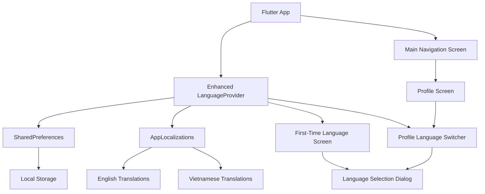
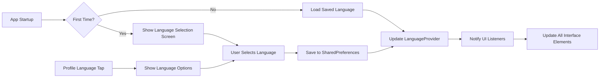
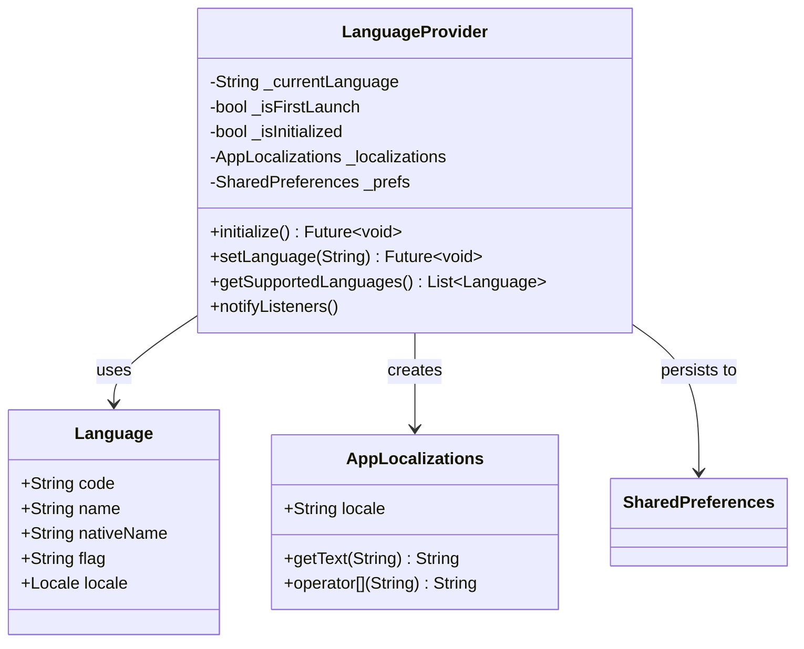
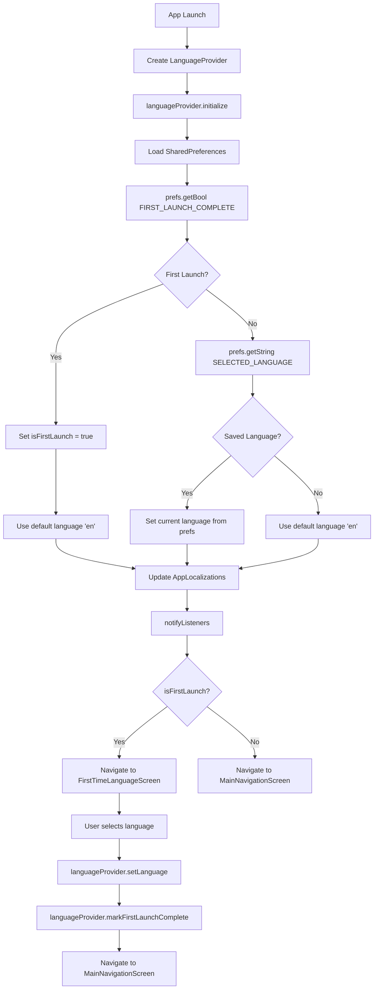
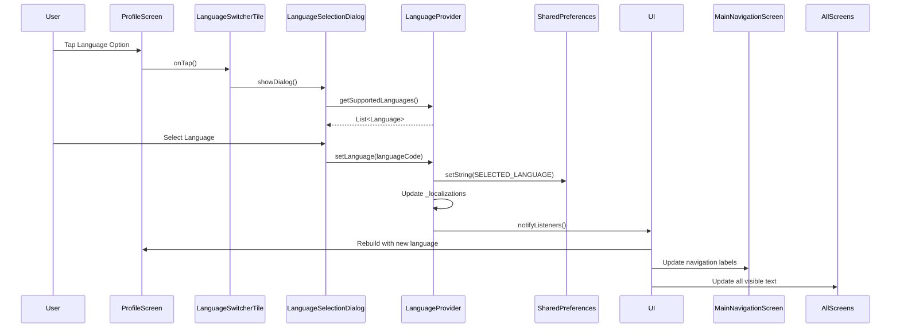
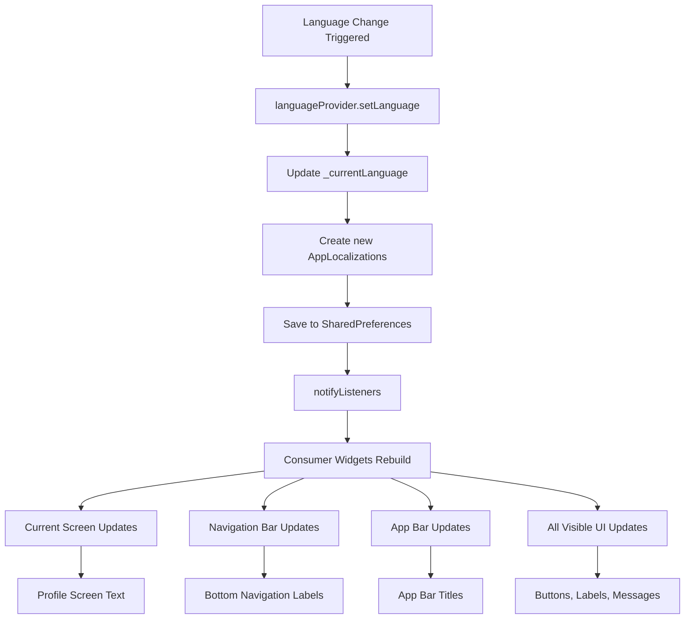
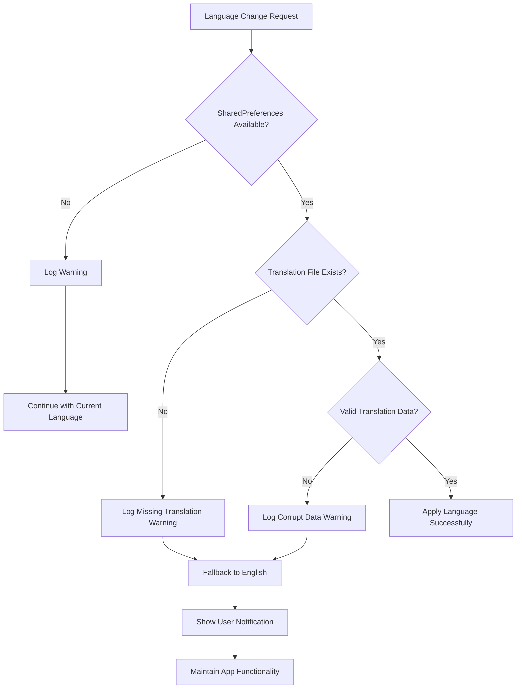

# Language Switcher Design Document

## Overview

The Language Switcher feature enables users to switch the app's interface language between English and Vietnamese. This design enhances the existing LanguageProvider to support persistence, first-time language detection, Profile tab integration, and real-time language switching without app restart. The implementation prioritizes user experience by providing immediate language changes and maintaining preferences across app sessions.

## Architecture Design

### System Architecture Diagram



### Data Flow Diagram



## Component Design

### Enhanced LanguageProvider

**Responsibilities:**
- Manage current language state with persistence
- Handle first-time language detection and initialization
- Provide localization services to the entire app
- Notify UI components of language changes
- Fallback to default language when translations are missing

**Interfaces:**
```dart
class LanguageProvider extends ChangeNotifier {
  // State management
  String get currentLanguage;
  Locale get currentLocale;
  AppLocalizations get l10n;
  bool get isFirstLaunch;
  
  // Language operations
  Future<void> initialize();
  Future<void> setLanguage(String languageCode);
  Future<void> markFirstLaunchComplete();
  
  // Supported languages
  List<Language> getSupportedLanguages();
  Language getLanguageByCode(String code);
}
```

**Dependencies:**
- SharedPreferences for persistence
- AppLocalizations for translations
- Flutter ChangeNotifier for state management

### Language Model

**Responsibilities:**
- Define language metadata including code, native name, and flag
- Provide structured data for language selection UI

**Interfaces:**
```dart
class Language {
  final String code;
  final String name;
  final String nativeName;
  final String flag;
  final Locale locale;
  
  const Language({
    required this.code,
    required this.name,
    required this.nativeName,
    required this.flag,
    required this.locale,
  });
}
```

### First-Time Language Selection Screen

**Responsibilities:**
- Present language options to new users
- Handle initial language selection
- Navigate to main app after selection
- Provide accessible and intuitive language selection UI

**Interfaces:**
```dart
class FirstTimeLanguageScreen extends StatelessWidget {
  Future<void> _handleLanguageSelection(Language language);
  Widget _buildLanguageOption(Language language);
  Widget _buildLanguageList();
}
```

### Profile Language Switcher Widget

**Responsibilities:**
- Display current language in Profile tab
- Provide access to language selection dialog
- Show language change confirmation
- Integrate seamlessly with existing Profile screen

**Interfaces:**
```dart
class LanguageSwitcherTile extends StatelessWidget {
  final VoidCallback? onTap;
  Widget _buildCurrentLanguageDisplay();
  Widget _buildLanguageDialog();
}
```

### Language Selection Dialog

**Responsibilities:**
- Present available languages in a modal dialog
- Handle language selection and confirmation
- Provide immediate UI feedback
- Support both first-time and profile-initiated selections

**Interfaces:**
```dart
class LanguageSelectionDialog extends StatefulWidget {
  final Language currentLanguage;
  final Function(Language) onLanguageSelected;
  
  Widget _buildLanguageList();
  Widget _buildLanguageItem(Language language);
}
```

## Data Model

### Core Data Structure Definitions

```typescript
// Language definition
interface Language {
  code: string;           // ISO language code (e.g., 'en', 'vi')
  name: string;          // English name (e.g., 'English', 'Vietnamese')
  nativeName: string;    // Native name (e.g., 'English', 'Tiếng Việt')
  flag: string;          // Unicode flag emoji (e.g., '🇺🇸', '🇻🇳')
  locale: Locale;        // Flutter Locale object
}

// Persistence keys
interface StorageKeys {
  SELECTED_LANGUAGE: 'selected_language';
  FIRST_LAUNCH_COMPLETE: 'first_launch_complete';
}

// Provider state
interface LanguageProviderState {
  currentLanguage: string;
  isFirstLaunch: boolean;
  isInitialized: boolean;
  supportedLanguages: Language[];
}
```

### Data Model Diagrams



## Business Process

### Process 1: App Initialization and First-Time Language Selection



### Process 2: Language Change from Profile Tab



### Process 3: Real-time Language Update Propagation



## Error Handling Strategy

### Language Loading Failures



### Error Handling Mechanisms

1. **Missing Translation Fallback**
   - When a translation key is missing, fall back to English text
   - Log warning for debugging purposes
   - Never show raw translation keys to users

2. **Storage Persistence Failures**
   - Continue with current session language if persistence fails
   - Show non-blocking notification to user about preference save failure
   - Attempt to retry persistence on next language change

3. **Initialization Failures**
   - Default to English language if initialization fails
   - Allow user to manually change language from Profile
   - Log detailed error information for debugging

4. **Network Independence**
   - All translations stored locally in app bundle
   - No network dependency for language switching
   - Immediate language changes without API calls

## UI/UX Specifications

### First-Time Language Selection Screen

**Design Requirements:**
- Full-screen modal with brand colors and gradient background
- Large, easily tappable language options (minimum 44pt touch target)
- Clear visual hierarchy with app logo and welcome message
- Native language names displayed prominently
- Flag emojis for visual recognition
- Smooth transition animations

**Layout Structure:**
```
┌─────────────────────────────┐
│        App Logo            │
│                           │
│     Welcome Message       │
│   "Choose your language"   │
│                           │
│  ┌─────────────────────┐   │
│  │ 🇺🇸  English        │   │
│  └─────────────────────┘   │
│                           │
│  ┌─────────────────────┐   │
│  │ 🇻🇳  Tiếng Việt     │   │
│  └─────────────────────┘   │
│                           │
└─────────────────────────────┘
```

### Profile Tab Language Switcher

**Design Requirements:**
- Consistent with existing Profile screen ListTile pattern
- Shows current language with flag and native name
- Integrates seamlessly between "Settings" and "Logout" options
- Provides clear visual feedback for current selection
- Uses existing app theming and styling

**Integration Layout:**
```
Profile Actions Section:
├── Refresh Profile
├── Settings  
├── Language (NEW)
│   ├── Icon: 🌐
│   ├── Title: "Language"
│   ├── Subtitle: Current language display
│   └── Trailing: Arrow + Current flag
└── Logout
```

### Language Selection Dialog

**Design Requirements:**
- Modal bottom sheet or dialog following Material Design guidelines
- List of available languages with radio button selection
- Current language clearly marked as selected
- Smooth animations for selection changes
- Immediate UI updates upon selection

## Technical Implementation Strategy

### Phase 1: Enhanced LanguageProvider Implementation
1. Add SharedPreferences dependency to LanguageProvider
2. Implement persistence methods (load/save language preference)
3. Add first-time detection logic
4. Enhance initialization with async loading
5. Add supported languages configuration

### Phase 2: First-Time Language Selection
1. Create FirstTimeLanguageScreen widget
2. Implement language selection UI with proper styling
3. Add navigation logic for first-time flow
4. Integrate with app startup sequence in main.dart

### Phase 3: Profile Integration
1. Create LanguageSwitcherTile widget for Profile screen
2. Add language selection dialog component
3. Integrate switcher into existing Profile screen layout
4. Ensure proper positioning between Settings and Logout

### Phase 4: Localization Enhancement
1. Expand translation coverage for all UI elements
2. Add translations for new language switcher components
3. Implement proper error messages and fallbacks
4. Test translation completeness across all screens

### Phase 5: Testing and Refinement
1. Test first-time user experience flow
2. Verify persistence across app restarts
3. Test real-time language switching on all screens
4. Validate accessibility and usability requirements

## Testing Strategy

### Unit Testing
- Test LanguageProvider state management and persistence
- Test Language model data integrity
- Test translation fallback mechanisms
- Test first-time detection logic

### Widget Testing
- Test FirstTimeLanguageScreen UI and interactions
- Test LanguageSwitcherTile rendering and tap handling
- Test LanguageSelectionDialog functionality
- Test Profile screen integration

### Integration Testing
- Test end-to-end first-time language selection flow
- Test language switching from Profile tab
- Test persistence across app restart scenarios
- Test real-time UI updates across multiple screens

### User Experience Testing
- Verify accessibility compliance for all language selection UI
- Test with both English and Vietnamese users
- Validate translation quality and completeness
- Ensure smooth animation and transition experiences

## Performance Considerations

### Memory Management
- Lazy loading of AppLocalizations instances
- Efficient translation key lookup with fallback
- Minimal memory footprint for language switching

### Storage Efficiency
- Use lightweight SharedPreferences for language storage
- Store only necessary language preference data
- Quick initialization without blocking app startup

### UI Performance
- Optimize rebuilds using Consumer widgets selectively
- Minimize unnecessary widget rebuilds during language changes
- Use efficient translation key access patterns

This design provides a comprehensive foundation for implementing the language switcher feature while maintaining the existing app architecture and ensuring a smooth user experience.