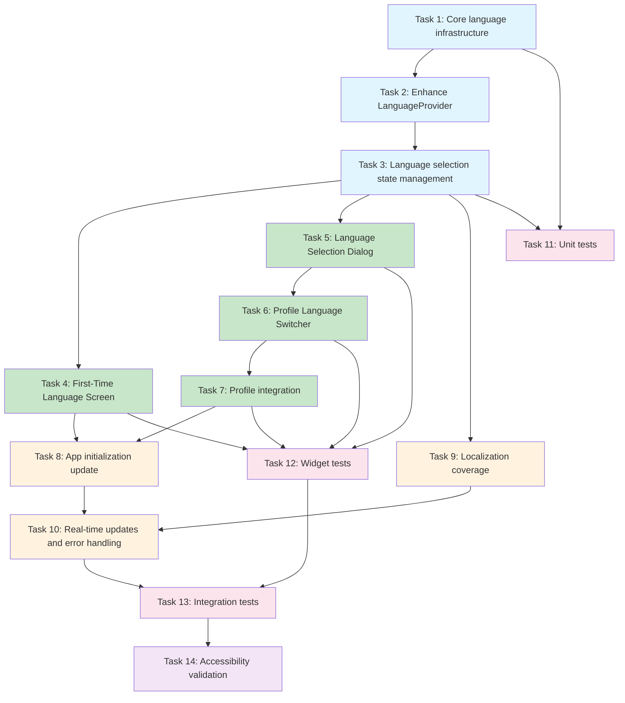

# Language Switcher Implementation Tasks

## Implementation Plan

- [ ] 1. Set up core language infrastructure and models
  - Create Language model class with code, name, native name, flag, and locale properties
  - Define constants for supported languages (English and Vietnamese)
  - Create storage key constants for SharedPreferences persistence
  - _Requirements: 1.2, 2.1, 8.1, 8.2_

- [ ] 2. Enhance LanguageProvider with persistence capabilities
  - Add SharedPreferences dependency injection to LanguageProvider
  - Implement async initialization method that loads saved language preference
  - Add first-time launch detection using SharedPreferences boolean flag
  - Implement language persistence methods (save/load from SharedPreferences)
  - Add supported languages getter method that returns Language objects
  - _Requirements: 2.1, 2.2, 7.1, 7.2, 8.1_

- [ ] 3. Implement language selection and state management
  - Add setLanguage method that updates current language and notifies listeners
  - Implement markFirstLaunchComplete method for first-time setup completion
  - Add proper error handling with fallback to English when translations missing
  - Create method to update AppLocalizations instance when language changes
  - _Requirements: 4.1, 4.2, 6.3, 8.4_

- [ ] 4. Create First-Time Language Selection Screen
  - Build FirstTimeLanguageScreen widget with full-screen language selection UI
  - Implement language option tiles with flags, native names, and tap handlers
  - Add proper styling with app branding and smooth animations
  - Handle language selection and navigation to main app after selection
  - _Requirements: 7.1, 7.3, 7.4, 5.3, 5.4_

- [ ] 5. Create Language Selection Dialog component
  - Build reusable LanguageSelectionDialog widget for both first-time and profile use
  - Implement modal dialog with list of available languages and radio button selection
  - Add current language highlighting and immediate selection feedback
  - Handle language selection callback and dialog dismissal
  - _Requirements: 1.2, 1.4, 5.3, 5.4_

- [ ] 6. Create Profile Language Switcher integration
  - Build LanguageSwitcherTile widget that displays current language with flag
  - Add tap handler that opens LanguageSelectionDialog
  - Style tile to match existing Profile screen ListTile pattern
  - Position between Settings and Logout options in Profile screen
  - _Requirements: 1.1, 1.3, 5.1, 5.2_

- [ ] 7. Integrate language switcher into Profile screen
  - Import and add LanguageSwitcherTile to Profile screen widget tree
  - Position the language switcher in the correct location within profile actions
  - Ensure proper Consumer wrapper for real-time language updates
  - Test integration maintains existing Profile screen functionality
  - _Requirements: 1.1, 4.3, 4.4_

- [ ] 8. Update main app initialization for first-time language selection
  - Modify main.dart to check LanguageProvider.isFirstLaunch on startup
  - Add conditional navigation logic to show FirstTimeLanguageScreen or main app
  - Ensure LanguageProvider is properly initialized before MaterialApp creation
  - Test first-time user flow from app launch to language selection to main screen
  - _Requirements: 7.1, 7.5, 2.2_

- [ ] 9. Expand localization coverage for language switcher components
  - Add translation keys for all language switcher UI text (titles, buttons, labels)
  - Create Vietnamese translations for language switcher interface elements
  - Add error message translations for language switching failures
  - Include translations for first-time language selection screen text
  - _Requirements: 3.1, 3.2, 6.3, 5.4_

- [ ] 10. Implement real-time UI updates and error handling
  - Ensure all screens rebuild immediately when language changes using Consumer widgets
  - Add error handling for SharedPreferences failures with user notifications
  - Implement translation key fallback mechanism defaulting to English
  - Test language switching maintains app state and doesn't interrupt ongoing operations
  - _Requirements: 4.1, 4.2, 4.3, 6.1, 6.2, 6.4_

- [ ] 11. Create unit tests for language functionality
  - Write unit tests for Language model data integrity and methods
  - Test LanguageProvider initialization, persistence, and state management methods
  - Test first-time detection logic and language preference loading/saving
  - Test error handling and fallback mechanisms for missing translations
  - _Requirements: 6.1, 6.2, 6.3, 8.4_

- [ ] 12. Create widget tests for UI components
  - Write widget tests for FirstTimeLanguageScreen rendering and interactions
  - Test LanguageSelectionDialog functionality and language selection handling
  - Test LanguageSwitcherTile rendering, current language display, and tap behavior
  - Test Profile screen integration maintains existing functionality
  - _Requirements: 1.2, 1.3, 1.4, 7.3, 7.4_

- [ ] 13. Create integration tests for end-to-end language switching
  - Test complete first-time language selection flow from app launch to main screen
  - Test language switching from Profile tab with immediate UI updates
  - Test language persistence across app restart scenarios
  - Test real-time language updates propagate to all visible screens and navigation
  - _Requirements: 2.1, 2.2, 4.1, 4.2, 4.3, 4.4, 7.1, 7.4, 7.5_

- [ ] 14. Validate accessibility and user experience requirements
  - Ensure language switcher meets minimum touch target size requirements (44pt)
  - Verify language options display native names correctly (English, Tiếng Việt)
  - Test language switcher accessible within 2 taps from main screen
  - Validate smooth animations and transitions during language changes
  - _Requirements: 5.1, 5.2, 5.3, 5.4_

## Tasks Dependency Diagram

